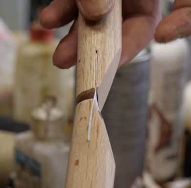

# Marionet Interface

## How can we track the movement of a marionet?

### Flex Sensors?

By using [Flex Sensors](https://en.wikipedia.org/wiki/Flex_sensor) as the joints of a marionette, we can sense it's movements. This has some advantages like a relatively easy setup by connecting all sensors to a ADC converter and e.g. to an ESP32 microcontroller. Disadvantage is, that the joint's movements depend on the flexibility of the Flex Sensors. The joints of a marionet are usually made of fabric, leather or strings, which is more flexible than the material of Flex Sensors. The unique, characterstical movement of the marionet would disappear. Another disadvantage is that the Flex Sensors only have one dimension, which is fine for e.g. the elbow joints, but does not work for the neck, the shoulder or other body parts.




### Camera Tracking?

Another idea is to use camera tracking. We tested a Microsoft Kinect, which detected the marionet only *sometimes*. Another option would be the Stereolabs Zed2, not tested at the moment. Third option is Googles MediaPipe which did a great job in another project.

The downsides of all camera tracking setups (with a single camera) are:

* the puppeteers need to stay within the viewport of the camera
* we only get 2D-data (unless a stereoscopic or ToF Sensor like the Microsoft Kinect would work)
* puppeteers need to pay attention to not obscure the marionet from the camera

It would be possible to use a camera array, but the setup, adjustment and evaluation of the data gets complex. And we still want to get realtime tracking data. But our biggest downside is that the puppeteers need to stay within the viewport of the camera and therefore would loose freedom while playing. A bigger camera viewport (wide-angle lenses or camera more far away) would mean a smaller image of the marionet in the camera frame and therefore less resolution for body-tracking)

### 9-DOF-Sensors!

By assembling a 9-DOF-Sensor (9 degrees of freedom) to each body part we are going into the same technical direction like e.g. the [Rokoko-Suit](https://www.rokoko.com/products/smartsuit-pro).
A 9-DOF-Sensor consists of three movement sensors:

* Accelerometer: Linear acceleration (m/s²).
* Gyroscope: Angular velocity (degrees/second or rad/s).
* Magnetometer: Magnetic field strength (microteslas or gauss).

The former two are relative measurements, the latter gives absolute results. For a more accurate and reliable orientation tracking, we need to combine the sensors with a technology called **sensor fusion**. We could use the Kalman Filter for this task or, fortunately, there are already some 9-DOF-Sensors with integrated sensor fusion on the market.

#### Hardware setup

There should be one 9-DOF-sensor on each moving part of the body. (We only get rotational data and no position data. See section "Forward Kinematic / Inverse Kinematic" below)

The basic body parts are:

* Torso, head, upper arms, forearms, thighs, lower legs.

...which make 10 sensors in total. An extended version would include both feet and hands or other moving parts attached to the puppet, but this might also be facted with physics in Blender. 

In theory we could daisy chain the sensors on a single I2C bus, but only if each sensor gets it's own I2C address. Because only some of the sensors from Adafruit can change their address, and if so, only in a limited way (choose one of two possible addresses), a maximum of two sensors can be attached to a single microcontroller.

Solutions are:

* use an I2C multiplexer to get all sensors to a single microcontroller
	* pros: simple wiring, only one microcontroller needs power. Maybe some more capacitors are needed at the sensors.
	* cons: not all sensors work with a multiplexer
* use multiple microcontrollers with two sensors each
	* pros: more flexible setup
	* cons: more microcontrollers (with power distribution) needed, 

#### Issues during the first research phase

After a first research, I get two of the [BNO085](https://www.adafruit.com/product/4754) (this turns out to work not the way I want). According to the product page, I can change the I2C address so that I'm able to use two sensors with one microcontroller (I take the [Adafruit QT Py ESP32-S2 WiFi](https://www.adafruit.com/product/5325). While I get the sensor data from each sensor precisely, I don't get both of them to work simultanously. After a chat in Adafruit's Discord channel, Dan Halbert from Adafruit explains:

> I looked at the library code, and the library is only supporting one Adafruit_I2CDevice, which I believe is wrong. [...]
>
> I'm discussing this internally, and it's not clear how easy this is to fix. It depends on the Bosch-supplied library we use underneath being re-entrant, and it may not be (but we need to look). [...]
>
> Indeed, there is a problem with the underlying code that we didn't write.

He was so kind to create an [issue on github](https://github.com/adafruit/Adafruit_BNO08x/issues/32) and also to write a note in the product page, but for our project we need another sensor. Adafruit has a [list of it's 9-DOF-sensors](https://www.adafruit.com/search?q=9-dof) as well as a [list of troublesome I2C sensors](https://learn.adafruit.com/i2c-addresses/troublesome-chips).

“Can’t I just use SPI to connect the sensors?”, you may ask. Of course you could but you would need more cables (six in total) which makes the marionet more stiff and I would like to keep the simple Stemma plug’n’play connectors. Also I don’t know if Adafruit’s library reliably supports multiple BNO085 via SPI.

Let’s have a look at the other sensors:

## Looking for a suitable 9-DOF sensor

**[BNO085](https://www.adafruit.com/product/4754)** - was the one we use at the moment. You can change the I2C address to get two of them on one I2C bus, but the underlying library has issues with addressing two sensors. It has build in sensor fusion which makes it more easy to use and more precise than other sensors.

**BNO055** - is also listed on [Adafruits list with troublesome chips](https://learn.adafruit.com/i2c-addresses/troublesome-chips), but in [another forum thread](https://forums.adafruit.com/viewtopic.php?t=200503) I read it works fine with two of them on one I2C bus ("*I ended up switching from BNO085 to BNO055, and everything works as it should.*"). Directly compared to BNO085, it's not as good/precise.

**LSM9DS1** - can’t see that the I2C address can be changed. -> I2CMultiplexer?

**LSM6DSOX + LIS3MDL** - two sensor possible by changing I2C address. Can you combine it with a multiplexer? Check out the “learn section” here: <https://www.adafruit.com/product/4517>

**TDK InvenSense ICM-20948 (MPU-9250 Upgrade)** - I2C address can be changed with solder jumper, but not sure if the library can handle two of them though?

**MPU-9250** - discontinued

```
>>> The question which sensor to use is still open! <<<
```


## Getting the data into Blender

The example in `02_Arduino/20240822_BNO085_to_OSC` shows how to send the data as Quaternion Rotation via OSC to Blender. 

In Blender (tested with 4.2) I used the addon [NodeOSC](https://github.com/maybites/NodeOSC/releases/tag/V2.4.1) (tested version 2.4.1). Check out this [tutorial for NodeOSC](https://www.youtube.com/watch?v=w_Nye09FyRQ), it's pretty straight forward and simple to use. The OSC-Address is `/mollusc/1`, incoming port is `6448`. Both can be changed in the Arduino code if needed.

The OSC-Addresses can be changed to `/puppet_name/torso`, `/puppet_name/head`, `/puppet_name/upper_arm_left`, `/puppet_name/upper_arm_right` and so on.

In Blender, the object's *rotation data mode* needs to be changed to Quaternion:


Right-click one of the Rotation-values and choose "Create a node osc handler" from the context menu (as shown in the NodeOSC-tutorial). The four sensor values from the OSC message...

```
msg.add(sensorValue.un.gameRotationVector.real);
msg.add(sensorValue.un.gameRotationVector.i);
msg.add(sensorValue.un.gameRotationVector.j);
msg.add(sensorValue.un.gameRotationVector.k);
```
...are mapped to the four Quaternion Rotation Values `W, X, Y, Z` by the NodeOSC addon.

Finally it looks like this:


**Note:** At the moment, the Arduino code sends the data 10 times per seconds to Blender (see `delay(100);` at the beginning of the main loop). Change this to  `delayMicroseconds(16667);` to get 60 fps, or, even better, use a non-blocking timer with `micros()` to send the data with 60fps.


## Appendix A: Forward Kinematic / Inverse Kinematic

We use the basic approach of Forward Kinematic. Inverse Kinematic could only be used if we had positional tracking of the hands/forearms and feed/lower legs. 

The marionet model needs to be hierarchically set up with respective parents and anchor points of the body parts. Only rotation will move the body parts.

## Appendix B: Sensor Fusion

When looking for a sensor, I mentioned the importance of sensor fusion. Because it's sometimes not quite obvious, let chatGPT explain it:

***Hey ChatGPT, if I want to get the rotation data from the sensor, why can't I only use the magnetometer? Why do I need sensor fusion?***

"Using only a magnetometer to determine the rotation of a sensor has limitations, which is why sensor fusion—combining data from the magnetometer, accelerometer, and gyroscope—is necessary for accurate and reliable orientation tracking. Here's why:

**1. Magnetometer Limitations:**

* Magnetic Interference: Magnetometers are highly sensitive to external magnetic fields. Nearby ferromagnetic materials (like metal objects) or electronic devices can distort the readings. This interference can cause inaccuracies in determining the direction of the Earth's magnetic field, leading to incorrect orientation data.
* Limited to Horizontal Orientation: A magnetometer primarily provides reliable heading (yaw) information when the device is held horizontally. If the device is tilted or in a non-horizontal position, the magnetometer's readings alone aren't enough to accurately determine the full 3D orientation (pitch, roll, and yaw).
* Slow Response: Magnetometers typically have a slower response time compared to accelerometers and gyroscopes. This can make them less effective for tracking fast movements or rapid changes in orientation.

**1. Sensor Fusion Benefits:**

* Compensating for Weaknesses: Each sensor has strengths and weaknesses. By combining data from all three sensors, sensor fusion algorithms (like the Kalman filter or complementary filter) can mitigate individual sensor limitations. 
  * Accelerometer: Provides information on the direction of gravity, which helps determine the pitch and roll. However, it is noisy and can be inaccurate due to linear acceleration.
  * Gyroscope: Provides smooth and fast tracking of rotation (pitch, roll, and yaw) but suffers from drift over time.
  * Magnetometer: Provides an absolute reference for yaw (compass direction), helping correct the gyroscope's drift and inaccuracies in the accelerometer's tilt measurements.
* Enhanced Accuracy: By fusing data from all three sensors, the system can accurately track orientation in 3D space, correcting the gyroscope's drift using the magnetometer and accelerometer data, while filtering out noise and external magnetic interference.
* Dynamic Response: Sensor fusion allows for responsive and stable tracking of orientation, even during rapid movements or in environments with varying magnetic fields.

##### Summary:

Using only a magnetometer would provide unreliable and potentially inaccurate orientation data due to magnetic interference, slow response, and limitations in non-horizontal orientations. Sensor fusion leverages the strengths of the accelerometer, gyroscope, and magnetometer together to provide a more accurate, stable, and reliable measurement of the sensor's rotation and orientation in all three axes."